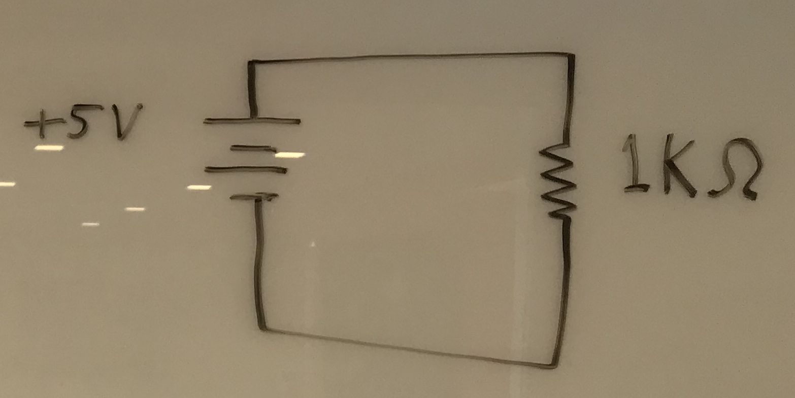
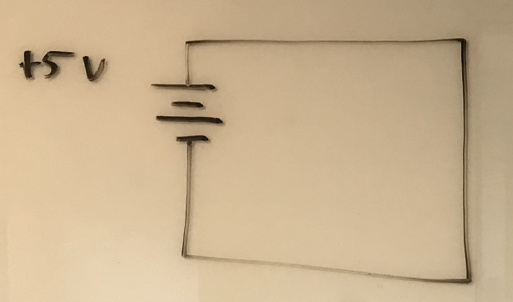
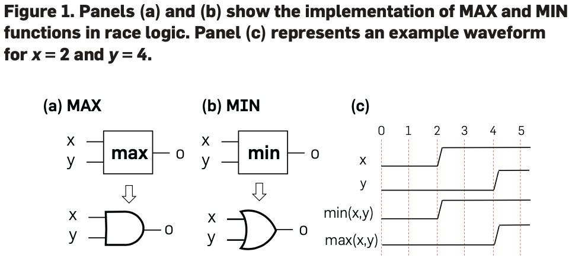
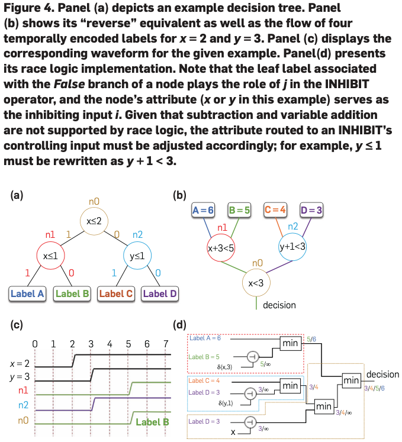
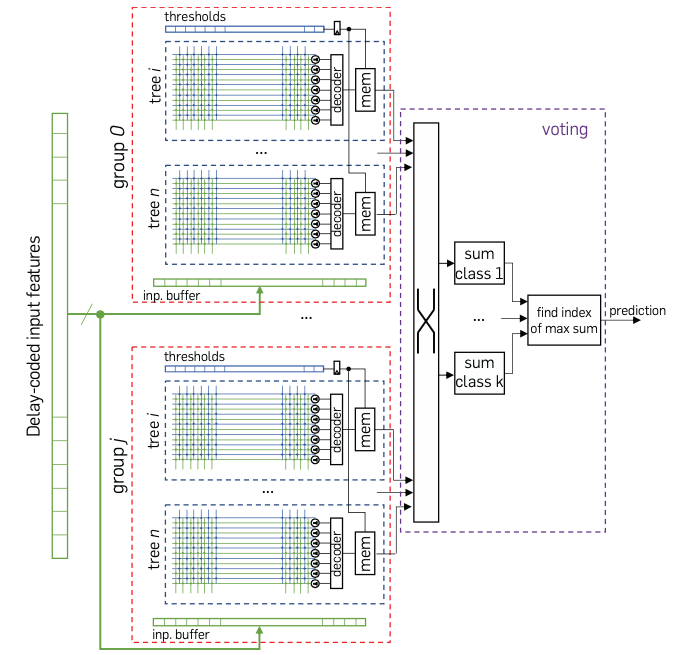

---
author: John Hanley
title: Race Logic
date: Friday, July 16th, 2021
---

# Race Logic

<!--- Copyright 2021, John Hanley
MIT licensed -- see end.
--->

overview of https://dl.acm.org/doi/pdf/10.1145/3460223
In-Sensor Classification
With Boosted Race Trees

by Tzimpragos et al.

# Moore's law

Things are no longer getting faster,
just denser.

# Thermal management -- heat

More bit flips means more $I^2 R$ heating

{height=2.3cm}

{height=2.3cm}

# Thermal management -- register

{
height=2cm}

{height=3.7cm}

# Thermal management -- gate

# Delay encoding

There's more than one way to store small integers.

"The key idea behind race logic is to encode values as a _delay_ from some reference."

# Computing with delay encoding

"basic temporal operators MAX, MIN, and ADD-CONSTANT ...
efficiently solve a class of dynamic programming algorithms"

# Reverse race trees

A decision tree, e.g. an XGBoost model,
can be implemented as a tree of signals racing from leaves to root.

At each node the first arriving signal wins, with others suppressed.

# Reverse race trees

{height=7.6cm}

# end-to-end architecture

4.1. From sensor to delay coded input

"Because sensory input is analog in nature, most sensors begin with
a measured voltage or current, which is then converted to a digital
output with the use of ADCs.
ADCs traditionally return digital binary values; however, given that
information in the time domain is now useful for computation, the
design of these components can be significantly simplified.
For instance, the costly time-to-digital conversion (TDC) in the ADCs
is redundant and can be skipped.
Examples of sensing systems that can provide directly time-encoded
outputs, without TDCs, include

1. Dynamic Vision Sensors (DVS),
2. Asynchronous Time-based Image Sensors (ATIS),
3. Time To First Spike (TTFS) and
4. Time-of-Flight (ToF) cameras, and
5. AER (Address Event Representation) Ear2 sound sensors."

# Implementation

"We also build a Python-based development flow,
which attaches to the popular scikit-learn library and leverages the
power of hardware templates and PyRTL -- a Python embedded hardware
design language -- to generate synthesizable RTL code.
More specifically, once the model is trained, the tool analyzes the
importance of input features, explores the learners’ performance
against lower resolution data, proceeds with votes quantization,
generates either a customized hardware design or a configuration file,
and performs cross-checking verification.
To obtain the desired implementation results, we use open-source tools
and a publicly available 14 nm standard cell library.
The operational voltage and frequency are 0.55 V and 1,000 MHz, respectively."

# Implementation

{height=7.6cm}

# Discussion

<!---
Copyright 2021 John Hanley.

Permission is hereby granted, free of charge, to any person obtaining a
copy of this software and associated documentation files (the "Software"),
to deal in the Software without restriction, including without limitation
the rights to use, copy, modify, merge, publish, distribute, sublicense,
and/or sell copies of the Software, and to permit persons to whom the
Software is furnished to do so, subject to the following conditions:
The above copyright notice and this permission notice shall be included in
all copies or substantial portions of the Software.
The software is provided "AS IS", without warranty of any kind, express or
implied, including but not limited to the warranties of merchantability,
fitness for a particular purpose and noninfringement. In no event shall
the authors or copyright holders be liable for any claim, damages or
other liability, whether in an action of contract, tort or otherwise,
arising from, out of or in connection with the software or the use or
other dealings in the software.
--->
